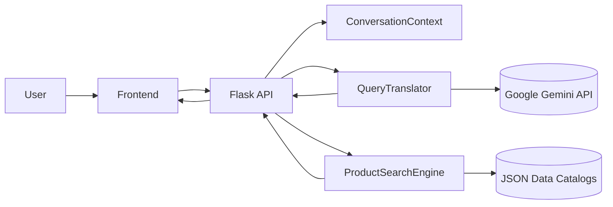

# 🛒 Grocery Shopping Chatbot (Gemini + LangChain + Flask + React)

An end-to-end AI shopping assistant that turns natural language into structured product searches over local JSON catalogs. It uses Google Gemini for robust, schema-validated query translation and a deterministic Python search engine for accurate results.

## 🌟 Highlights

- AI query translation with strict schema (Pydantic) and list-aware filters
- Inherit/override context semantics that “just work” across turns
- Fuzzy mapping for generic phrases (e.g., “food items” → sandwich, bagel, snack, salad)
- Negations and mutual exclusion handled correctly (vendors vs exclude_vendors)
- Deterministic product filtering with clear “reasons” (cheapest/most expensive, price bounds, tags)
- Clean UI with stable product cards (no layout jump) and helpful context summaries

## 🧩 Architecture

```
User → Gemini (translate) → Pydantic ProductQuery → Python search → Results
               ↑                       ↓
           Context in              Conversation
             JSON                   memory
```

- `query_translator.py` (AI): Google Gemini (via LangChain) translates free text + previous context into a complete, merged ProductQuery.
- `conversation_memory.py` (Memory): A “dumb” mirror of the AI state—no extra rules, no conflicts.
- `product_search.py` (Engine): Pure, deterministic filtering on JSON catalogs with list support and reasons.
- `api_server.py` (API): Flask endpoints consumed by the React frontend.
- `frontend/` (UI): Vite + React chat app with stable product cards.

### Mermaid architecture (renders on GitHub)



## � Setup (.env)

Create a `.env` file at the project root with your Gemini API key (get one at https://aistudio.google.com/app/apikey). Either variable name works:

```
GOOGLE_API_KEY=your_gemini_api_key_here
```

Tip: An `.env.example` is included for reference.

## 🚀 Run (Windows PowerShell)

1) Create and activate a virtual environment

```powershell
python -m venv .venv
.\.venv\Scripts\Activate.ps1
```

2) Install backend dependencies

```powershell
pip install -r requirements.txt
```

3) Install frontend dependencies (use npm ci for a clean, lockfile-resolved install)

```powershell
cd frontend
npm ci
cd ..
```

4) Start both servers with one command

```powershell
.\start_single.bat
```

This starts:
- Backend API: http://localhost:5000
- Frontend UI: http://localhost:5173

Alternatively, run them separately:

```powershell
# Terminal 1 (backend)
.\.venv\Scripts\python.exe api_server.py

# Terminal 2 (frontend)
cd frontend
npm run dev
```

## � Data model (Pydantic)

Structured query returned by the translator (lists + price filter):

```json
{
  "vendors": ["Subway"],
  "exclude_vendors": ["ASDA"],
  "product_types": ["drink", "sandwich", "bagel", "snack", "salad"],
  "brand": "Coca-Cola",
  "tags": ["vegan", "gluten-free"],
  "price_filter": {"operator": "<=", "value": 3.0},
  "sort_by": "price_asc",
  "keywords": ["Coke", "Pepsi"]
}
```

Key semantics baked into the prompt:
- Inherit previous filters unless the user overrides them.
- Mutual exclusion: never set both `vendors` and `exclude_vendors` at the same time.
- Reset: “all shops”/“any vendor” clears vendor filters.
- Fuzzy mapping:
  - “food” / “food items” → product_types: [sandwich, bagel, snack, salad]
  - “beverages” / “drinks” → product_types: [drink]

## � Module overview (contracts)

- `GroceryChatbot.chat(user_input: str) -> dict`
  - Input: free text
  - Output: { message: str, products: list[dict], filters_used: dict }
  - Behavior: checks for “reset”; otherwise calls translator → updates memory → runs search → formats response.

- `QueryTranslator.translate_to_dict(user_query: str, context: dict|None) -> dict`
  - Input: user text + prior context
  - Output: full merged ProductQuery as dict (lists, optional price filter, sort, keywords)
  - Error mode: on parse error, returns empty query (engine safely returns empty results)

- `ProductSearchEngine.search(query: dict, limit: int = 10) -> list[dict]`
  - Filters: vendors (OR), exclude_vendors, product_types (OR), brand substring, tags (ALL), price ops (<, <=, >, >=, ==), keywords (OR over name/brand)
  - Sorting: price_asc, price_desc, name
  - Adds a `reason` string to each result (price bounds, tags, cheapest/most expensive when applicable)

- `ConversationContext`
  - `update_context(user_input, structured_query)`: mirrors AI state (source of truth)
  - `get_context()`: returns current context
  - `get_context_summary()`: human summary (Shop, Type, Tags, Price/Budget)
  - `has_active_context()`: true if any meaningful filter is active

## 🧪 Test scenarios (manual)

Use these to validate behavior quickly:

1) Vendor inheritance + keywords
   - “show me cheap Coke or Pepsi” → context: keywords, cheap
   - “from Subway” → vendors inherited; keywords preserved; returns Subway drinks matching Coke/Pepsi

2) Negation (mutual exclusion)
   - “from ASDA or Subway” → vendors: [ASDA, Subway]
   - “not from ASDA” → vendors cleared, exclude_vendors: [ASDA]; other filters preserved

3) Fuzzy mapping for generic type
   - With context “from Subway” then “food items” → product_types becomes [sandwich, bagel, snack, salad]; vendor inherited

4) New product type resets noisy filters
   - “vegan Coke” → tags + keywords
   - “show me sandwiches” → product_types: [sandwich]; keywords/tags dropped (by design)

5) Budget via sort
   - “I want expensive” → sort_by: price_desc; top result reason includes “most expensive option” (when no price_filter)

6) Reset command
   - “reset” → clears all context and memory

## � JSON catalogs

Located in `data/`:
- `asda_bagels.json`, `tesco_products.json`, `subway_menu.json`, `morrisons_products.json`, `sainsburys_products.json`, `waitrose_products.json`, `coop_products.json`, `lidl_products.json`

Each product:

```json
{
  "id": "unique_id",
  "name": "Product Name",
  "brand": "Brand Name",
  "price": 1.99,
  "vendor": "ASDA",
  "category": "drink",
  "tags": ["vegan", "gluten-free"],
  "calories": 200,
  "image": "https://example.com/image.jpg"
}
```

Add catalogs by dropping new JSON into `data/`. They’re loaded automatically on startup.

## 📚 Dependencies (backend)

Pinned in `requirements.txt`:

- flask==3.0.0, flask-cors==4.0.0, python-dotenv==1.0.0
- langchain==0.3.0, langchain-community==0.3.0, langchain-google-genai==2.0.0
- google-generativeai>=0.7.0,<0.8.0
- pydantic>=2.4.0,<3.0.0

Frontend dependencies are in `frontend/package.json` (React 18, Vite 5, Axios).

## 🔧 Troubleshooting

- “API key not found”: ensure `.env` exists with `GOOGLE_API_KEY` or `GEMINI_API_KEY`.
- Import errors: re-run `pip install -r requirements.txt` inside the virtualenv.
- No products: ensure JSON files exist in `data/`.
- Gemini quota/error: verify your key in Google AI Studio and retry.

## 📄 License

MIT-like for demo/assignment purposes. Use and modify as needed.

---

Built with Gemini, LangChain, Flask, and React. 🚀
